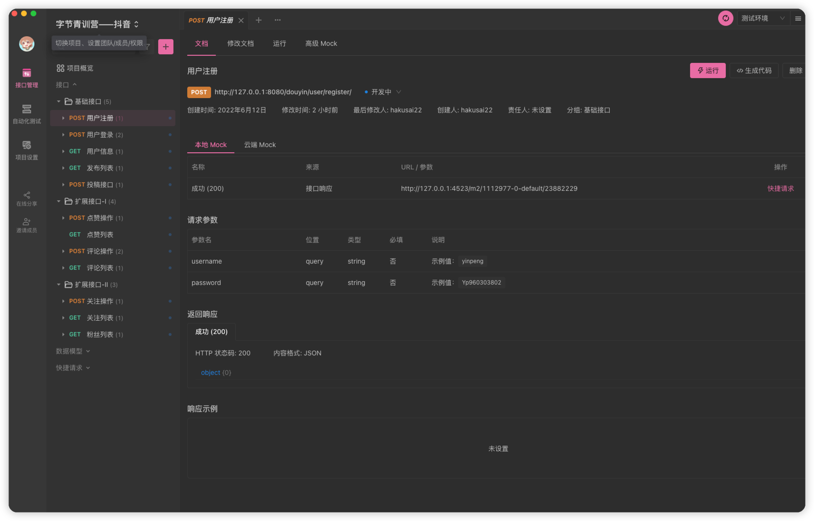
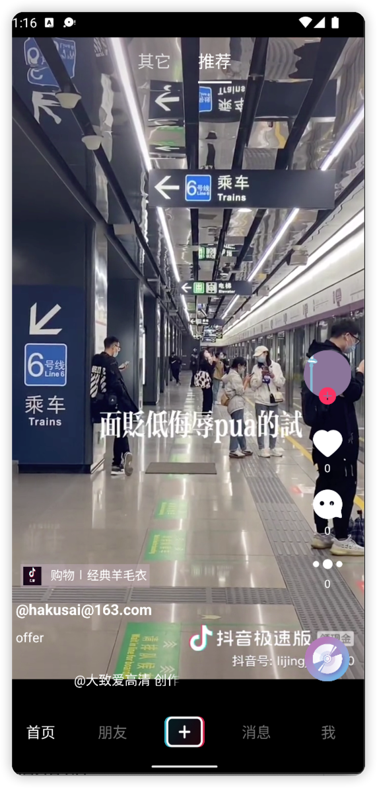

# douyin

<!-- PROJECT SHIELDS -->

[![Contributors][contributors-shield]][contributors-url]
[![Forks][forks-shield]][forks-url]
[![Stargazers][stars-shield]][stars-url]
[![MIT License][license-shield]][license-url]

<!-- PROJECT LOGO -->
 

<h3 align="center">字节青训营抖音项目</h3>

<!-- links -->
[your-project-path]:hakusai22/douyin
[contributors-shield]: https://img.shields.io/github/contributors/hakusai22/douyin.svg?style=for-the-badge
[contributors-url]: https://github.com/hakusai22/douyin/graphs/contributors
[forks-shield]: https://img.shields.io/github/forks/hakusai22/douyin.svg?style=for-the-badge
[forks-url]: https://github.com/hakusai22/douyin/network/members
[stars-shield]: https://img.shields.io/github/stars/hakusai22/douyin.svg?style=for-the-badge
[stars-url]: https://github.com/hakusai22/douyin/stargazers
[issues-shield]: https://img.shields.io/github/issues/hakusai22/douyin.svg?style=for-the-badge
[issues-url]: https://img.shields.io/github/issues/hakusai22/douyin.svg
[license-shield]: https://img.shields.io/github/license/hakusai22/douyin.svg?style=for-the-badge
[license-url]: https://github.com/hakusai22/douyin/blob/master/LICENSE
[linkedin-shield]: https://img.shields.io/badge/-LinkedIn-black.svg?style=for-the-badge&logo=linkedin&colorB=555
[linkedin-url]: https://linkedin.com/in/xxxx

